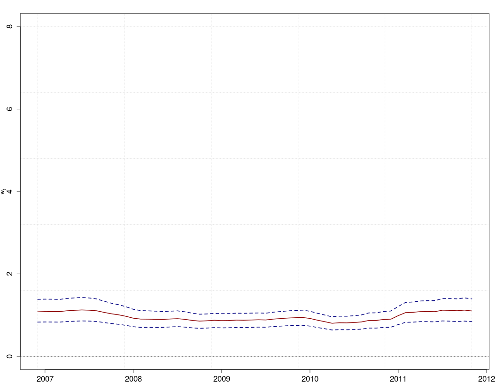

# Results obtained by considering the expected cases related to the population of the municipalities

Here, we considered $Y_{it} \sim Poisson(\lambda_{it})$, where $\lambda_{it}=E_i r_i$, i.e., the product of the expected number of cases (defined by the population of minicipality i) and its rate.
We used the 2010 population census. In the next results, we used the same parameterization from the paper. 

## Metrics evaluation

Posterior coefficients.

<table>
 <thead>
  <tr>
   <th style="text-align:left;"> Term </th>
   <th style="text-align:right;"> Intercept </th>
   <th style="text-align:right;"> poppy </th>
   <th style="text-align:right;"> marij </th>
   <th style="text-align:right;"> conf_lag </th>
   <th style="text-align:right;"> mig </th>
   <th style="text-align:right;"> trend </th>
  </tr>
 </thead>
<tbody>
  <tr>
   <td style="text-align:left;"> CAR+AR </td>
   <td style="text-align:right;"> 0.47 </td>
   <td style="text-align:right;"> 1.10 </td>
   <td style="text-align:right;"> 0.96 </td>
   <td style="text-align:right;"> 1.00 </td>
   <td style="text-align:right;"> 1.02 </td>
   <td style="text-align:right;"> 1.00 </td>
  </tr>
  <tr>
   <td style="text-align:left;"> CAR+AR - conf </td>
   <td style="text-align:right;"> 0.47 </td>
   <td style="text-align:right;"> 1.10 </td>
   <td style="text-align:right;"> 0.96 </td>
   <td style="text-align:right;"> NA </td>
   <td style="text-align:right;"> 1.02 </td>
   <td style="text-align:right;"> 1.00 </td>
  </tr>
  <tr>
   <td style="text-align:left;"> CAR+AR - mig </td>
   <td style="text-align:right;"> 0.47 </td>
   <td style="text-align:right;"> 1.10 </td>
   <td style="text-align:right;"> 0.96 </td>
   <td style="text-align:right;"> 1.00 </td>
   <td style="text-align:right;"> NA </td>
   <td style="text-align:right;"> 1.00 </td>
  </tr>
  <tr>
   <td style="text-align:left;"> ZIP1+CAR+CAR </td>
   <td style="text-align:right;"> 0.99 </td>
   <td style="text-align:right;"> 1.11 </td>
   <td style="text-align:right;"> 0.96 </td>
   <td style="text-align:right;"> 1.00 </td>
   <td style="text-align:right;"> 0.90 </td>
   <td style="text-align:right;"> 0.96 </td>
  </tr>
  <tr>
   <td style="text-align:left;"> ZIP0+CAR+AR </td>
   <td style="text-align:right;"> 5.60 </td>
   <td style="text-align:right;"> 1.11 </td>
   <td style="text-align:right;"> 0.95 </td>
   <td style="text-align:right;"> 1.00 </td>
   <td style="text-align:right;"> 0.46 </td>
   <td style="text-align:right;"> 0.93 </td>
  </tr>
</tbody>
</table>

Metrics

<table>
 <thead>
  <tr>
   <th style="text-align:left;"> metrica </th>
   <th style="text-align:right;"> RMSE </th>
   <th style="text-align:right;"> DIC </th>
   <th style="text-align:right;"> CPO </th>
   <th style="text-align:right;"> R2 </th>
  </tr>
 </thead>
<tbody>
  <tr>
   <td style="text-align:left;"> CAR+AR </td>
   <td style="text-align:right;"> 9.19 </td>
   <td style="text-align:right;"> 37652.25 </td>
   <td style="text-align:right;"> -18926.20 </td>
   <td style="text-align:right;"> 0.82 </td>
  </tr>
  <tr>
   <td style="text-align:left;"> CAR+AR - conf </td>
   <td style="text-align:right;"> 9.18 </td>
   <td style="text-align:right;"> 37651.28 </td>
   <td style="text-align:right;"> -18919.74 </td>
   <td style="text-align:right;"> 0.82 </td>
  </tr>
  <tr>
   <td style="text-align:left;"> CAR+AR - mig </td>
   <td style="text-align:right;"> 9.19 </td>
   <td style="text-align:right;"> 37652.41 </td>
   <td style="text-align:right;"> -18925.51 </td>
   <td style="text-align:right;"> 0.82 </td>
  </tr>
  <tr>
   <td style="text-align:left;"> ZIP1+CAR+CAR </td>
   <td style="text-align:right;"> 9.08 </td>
   <td style="text-align:right;"> 35119.13 </td>
   <td style="text-align:right;"> -17724.91 </td>
   <td style="text-align:right;"> 0.82 </td>
  </tr>
  <tr>
   <td style="text-align:left;"> ZIP0+CAR+AR </td>
   <td style="text-align:right;"> 9.54 </td>
   <td style="text-align:right;"> 41359.11 </td>
   <td style="text-align:right;"> -24503.06 </td>
   <td style="text-align:right;"> 0.82 </td>
  </tr>
</tbody>
</table>

## CAR + AR: full model

### Posterior distribution of fixed effects

### Spatial random effects. Structured (left) and unstructured (right)

<table align='center'>
<tr>
<td></td>
<td></td>
</tr>
</table>

### Temporal random effects

### Residuals

<table align='center'>
<tr>
<td></td>
<td></td>
<td></td>
</tr>
</table>

## CAR + AR model: Confrontations effect removed

### Posterior distribution of fixed effects

### Spatial random effects. Structured (left) and unstructured (right)

<table align='center'>
<tr>
<td></td>
<td></td>
</tr>
</table>

### Temporal random effects

### Residuals

<table align='center'>
<tr>
<td></td>
<td></td>
<td></td>
</tr>
</table>

## CAR + AR model: Migration effect removed

### Posterior distribution of fixed effects

### Spatial random effects. Structured (left) and unstructured (right)

<table align='center'>
<tr>
<td></td>
<td></td>
</tr>
</table>

### Temporal random effects

### Residuals

<table align='center'>
<tr>
<td></td>
<td></td>
<td></td>
</tr>
</table>

## ZIP0 + CAR + AR

### Posterior distribution of fixed effects

### Spatial random effects. Structured (left) and unstructured (right)

<table align='center'>
<tr>
<td></td>
<td></td>
</tr>
</table>

### Temporal random effects

### Residuals

<table align='center'>
<tr>
<td></td>
<td></td>
<td></td>
</tr>
</table>

## ZIP1 + CAR + AR

### Posterior distribution of fixed effects

### Spatial random effects. Structured (left) and unstructured (right)

<table align='center'>
<tr>
<td></td>
<td></td>
</tr>
</table>

### Temporal random effects

### Residuals

<table align='center'>
<tr>
<td></td>
<td></td>
<td></td>
</tr>
</table>

