# Sensitivity analysis of hyperparameters for a Bayesian hierarchical spatio-temporal model with separable space and time effects

Priors distributions considered for precision parameter $\sigma$ in BYM and AR1 models for spatial and temporal effects. Note that all priors in INLA are set in the internal representation of the parameter, therefore, $\sigma=\exp^{-\frac{\theta}{2}}$, and the prior is defined on $\theta$.

- `logGamma1`: LogGamma with parameters shape=1 and rate=.00005
- `logGamma1`: LogGamma with parameters shape=.001 and rate=.001
- `half.Normal`: Half-Normal with zero mean and precision parameter $\tau=.001$ 
- `half.Cauchy`: Half-Cauchy with scale parameter $\gamma=25$
- `half.T`: Half-t with parameter $\nu=3$ degrees of freedom
- `unif`: Uniform improper $p(\sigma)\propto 1$
- `pc.prec`: Penalized complexity prior for precision with parameters $(5, 0.01)$

For details, see 

Andrew Gelman. "Prior distributions for variance parameters in hierarchical models (comment on article by Browne and Draper)." Bayesian Anal. 1 (3) 515 - 534, September 2006. https://doi.org/10.1214/06-BA117A

Faraway, J., Wang, X., & Yue, Y. (2018). Bayesian Regression Modeling with INLA. Chapman & Hall.

## CAR + AR: full model

### Posterior distribution of fixed effects

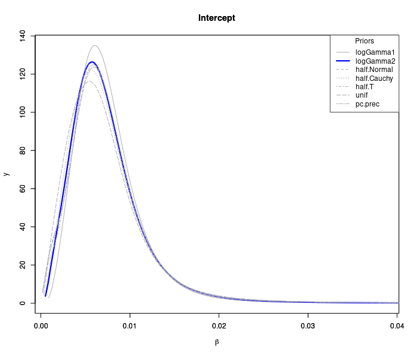

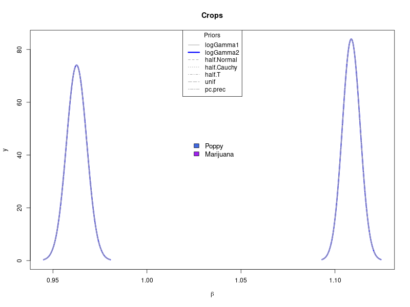

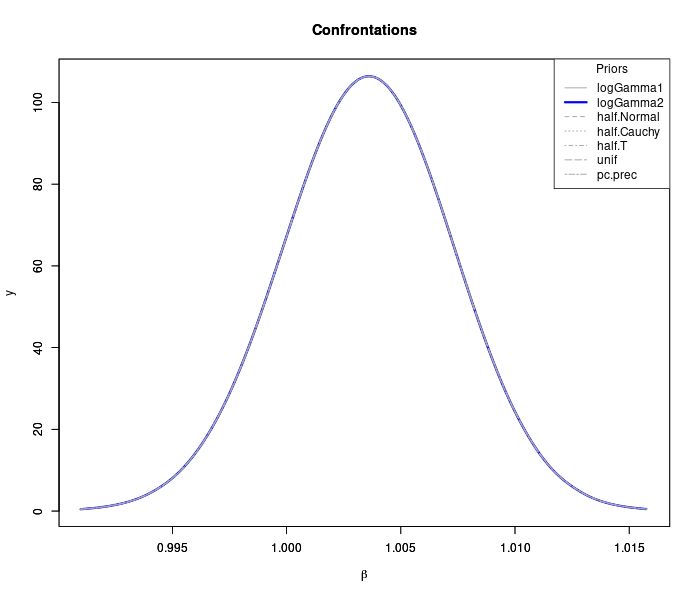

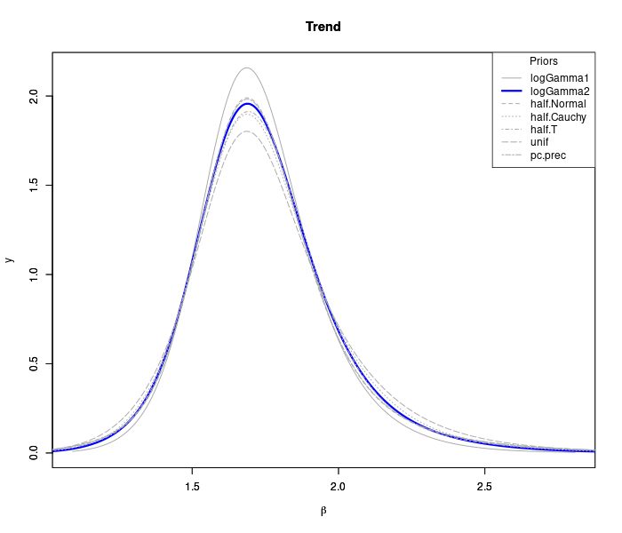

### Spatial random effects. Structured (left) and unstructured (right)

#### logGamma1

<table align='center'>
<tr>
<td>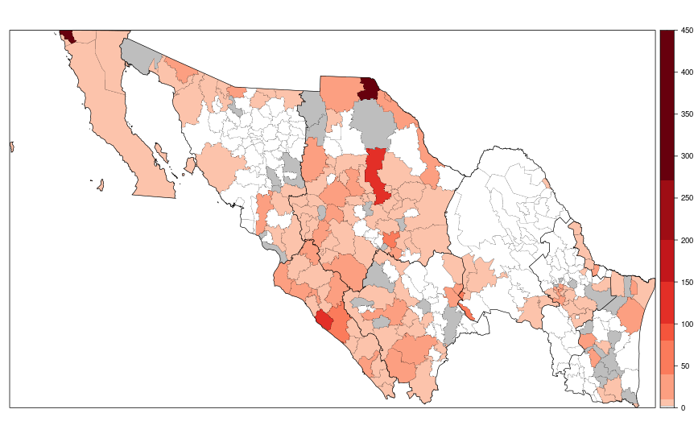</td>
<td></td>
</tr>
</table>

#### logGamma2

<table align='center'>
<tr>
<td></td>
<td></td>
</tr>
</table>

#### half.Normal

<table align='center'>
<tr>
<td></td>
<td></td>
</tr>
</table>

#### half.Cauchy

<table align='center'>
<tr>
<td>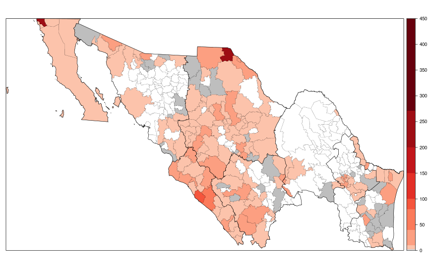</td>
<td></td>
</tr>
</table>

#### half.T

<table align='center'>
<tr>
<td></td>
<td>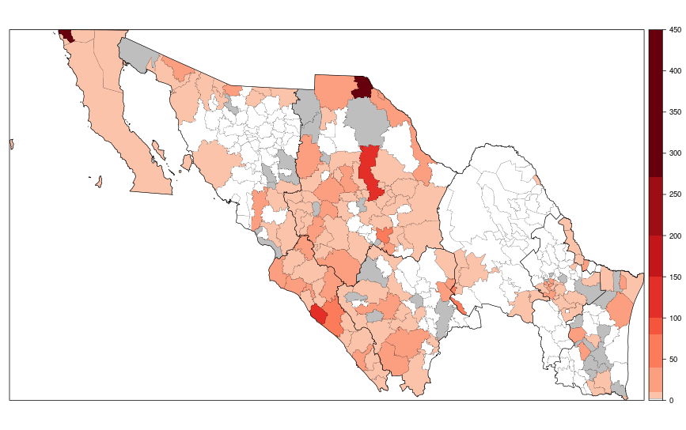</td>
</tr>
</table>

#### unif

<table align='center'>
<tr>
<td></td>
<td></td>
</tr>
</table>

#### pc.prec

<table align='center'>
<tr>
<td></td>
<td></td>
</tr>
</table>

### Temporal random effects

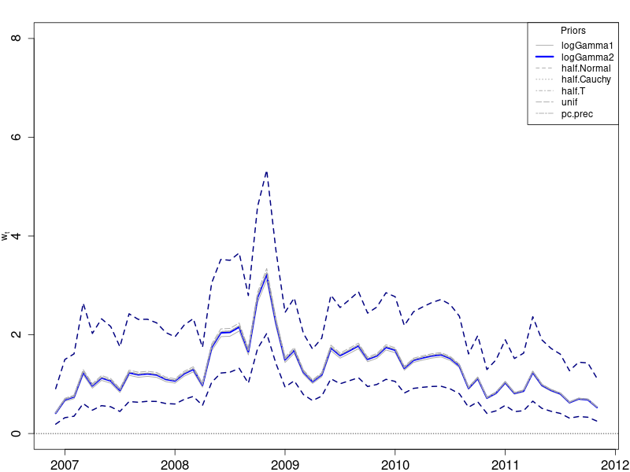

### Metrics evaluation

Posterior coefficients.

<table>
 <thead>
  <tr>
   <th style="text-align:left;"> term </th>
   <th style="text-align:right;"> logGamma1 </th>
   <th style="text-align:right;"> logGamma2 </th>
   <th style="text-align:right;"> half.Normal </th>
   <th style="text-align:right;"> half.Cauchy </th>
   <th style="text-align:right;"> half.T </th>
   <th style="text-align:right;"> unif </th>
   <th style="text-align:right;"> pc.prec </th>
  </tr>
 </thead>
<tbody>
  <tr>
   <td style="text-align:left;"> (Intercept) </td>
   <td style="text-align:right;"> 0.01 </td>
   <td style="text-align:right;"> 0.01 </td>
   <td style="text-align:right;"> 0.01 </td>
   <td style="text-align:right;"> 0.01 </td>
   <td style="text-align:right;"> 0.01 </td>
   <td style="text-align:right;"> 0.01 </td>
   <td style="text-align:right;"> 0.01 </td>
  </tr>
  <tr>
   <td style="text-align:left;"> amap </td>
   <td style="text-align:right;"> 1.11 </td>
   <td style="text-align:right;"> 1.11 </td>
   <td style="text-align:right;"> 1.11 </td>
   <td style="text-align:right;"> 1.11 </td>
   <td style="text-align:right;"> 1.11 </td>
   <td style="text-align:right;"> 1.11 </td>
   <td style="text-align:right;"> 1.11 </td>
  </tr>
  <tr>
   <td style="text-align:left;"> marih </td>
   <td style="text-align:right;"> 0.96 </td>
   <td style="text-align:right;"> 0.96 </td>
   <td style="text-align:right;"> 0.96 </td>
   <td style="text-align:right;"> 0.96 </td>
   <td style="text-align:right;"> 0.96 </td>
   <td style="text-align:right;"> 0.96 </td>
   <td style="text-align:right;"> 0.96 </td>
  </tr>
  <tr>
   <td style="text-align:left;"> rutmig1 </td>
   <td style="text-align:right;"> 4.43 </td>
   <td style="text-align:right;"> 4.38 </td>
   <td style="text-align:right;"> 4.38 </td>
   <td style="text-align:right;"> 4.39 </td>
   <td style="text-align:right;"> 4.37 </td>
   <td style="text-align:right;"> 4.39 </td>
   <td style="text-align:right;"> 4.37 </td>
  </tr>
  <tr>
   <td style="text-align:left;"> enfren.lweek </td>
   <td style="text-align:right;"> 1.00 </td>
   <td style="text-align:right;"> 1.00 </td>
   <td style="text-align:right;"> 1.00 </td>
   <td style="text-align:right;"> 1.00 </td>
   <td style="text-align:right;"> 1.00 </td>
   <td style="text-align:right;"> 1.00 </td>
   <td style="text-align:right;"> 1.00 </td>
  </tr>
  <tr>
   <td style="text-align:left;"> ym1 </td>
   <td style="text-align:right;"> 1.72 </td>
   <td style="text-align:right;"> 1.73 </td>
   <td style="text-align:right;"> 1.73 </td>
   <td style="text-align:right;"> 1.73 </td>
   <td style="text-align:right;"> 1.73 </td>
   <td style="text-align:right;"> 1.74 </td>
   <td style="text-align:right;"> 1.73 </td>
  </tr>
</tbody>
</table>

Metrics

<table>
 <thead>
  <tr>
   <th style="text-align:left;"> metrica </th>
   <th style="text-align:right;"> logGamma1 </th>
   <th style="text-align:right;"> logGamma2 </th>
   <th style="text-align:right;"> half.Normal </th>
   <th style="text-align:right;"> half.Cauchy </th>
   <th style="text-align:right;"> half.T </th>
   <th style="text-align:right;"> unif </th>
   <th style="text-align:right;"> pc.prec </th>
  </tr>
 </thead>
<tbody>
  <tr>
   <td style="text-align:left;"> RMSE </td>
   <td style="text-align:right;"> 9.15 </td>
   <td style="text-align:right;"> 9.15 </td>
   <td style="text-align:right;"> 9.15 </td>
   <td style="text-align:right;"> 9.15 </td>
   <td style="text-align:right;"> 9.15 </td>
   <td style="text-align:right;"> 9.15 </td>
   <td style="text-align:right;"> 9.15 </td>
  </tr>
  <tr>
   <td style="text-align:left;"> DIC </td>
   <td style="text-align:right;"> 36648.17 </td>
   <td style="text-align:right;"> 36652.35 </td>
   <td style="text-align:right;"> 36652.90 </td>
   <td style="text-align:right;"> 36652.85 </td>
   <td style="text-align:right;"> 36651.73 </td>
   <td style="text-align:right;"> 36652.97 </td>
   <td style="text-align:right;"> 36652.37 </td>
  </tr>
  <tr>
   <td style="text-align:left;"> CPO </td>
   <td style="text-align:right;"> -19609.26 </td>
   <td style="text-align:right;"> -19553.75 </td>
   <td style="text-align:right;"> -19524.64 </td>
   <td style="text-align:right;"> -19610.69 </td>
   <td style="text-align:right;"> -19459.76 </td>
   <td style="text-align:right;"> -19602.69 </td>
   <td style="text-align:right;"> -19485.10 </td>
  </tr>
  <tr>
   <td style="text-align:left;"> R2 </td>
   <td style="text-align:right;"> 0.82 </td>
   <td style="text-align:right;"> 0.82 </td>
   <td style="text-align:right;"> 0.82 </td>
   <td style="text-align:right;"> 0.82 </td>
   <td style="text-align:right;"> 0.82 </td>
   <td style="text-align:right;"> 0.82 </td>
   <td style="text-align:right;"> 0.82 </td>
  </tr>
</tbody>
</table>

## CAR + AR model: Confrontations effect removed

### Posterior distribution of fixed effects

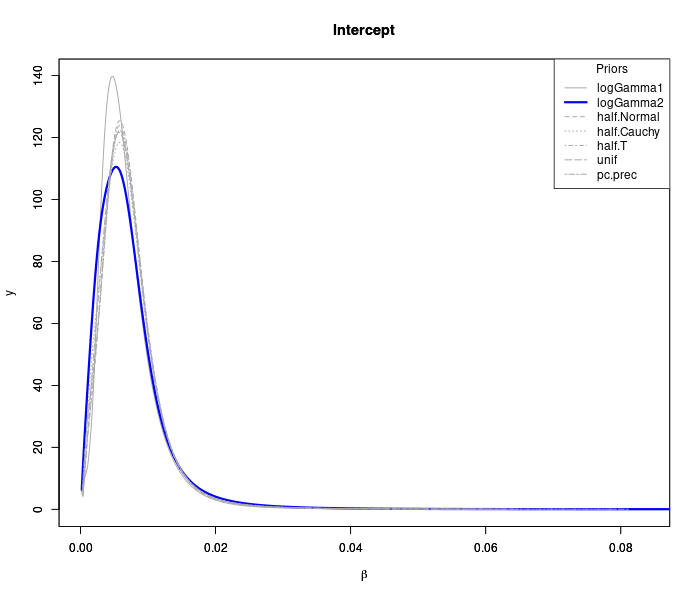

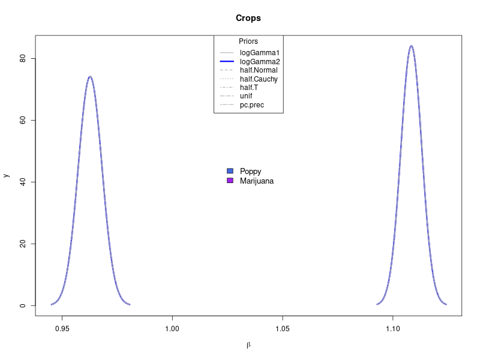

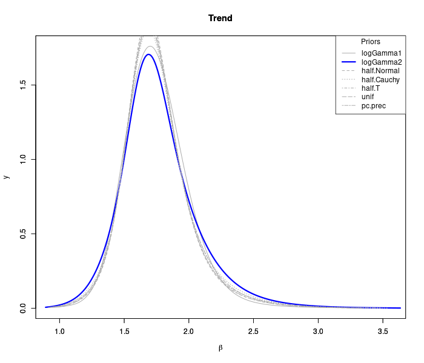

### Spatial random effects. Structured (left) and unstructured (right)

#### logGamma1

<table align='center'>
<tr>
<td>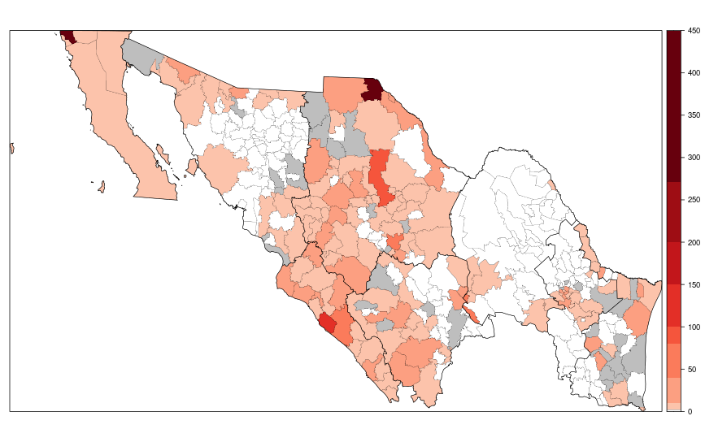</td>
<td>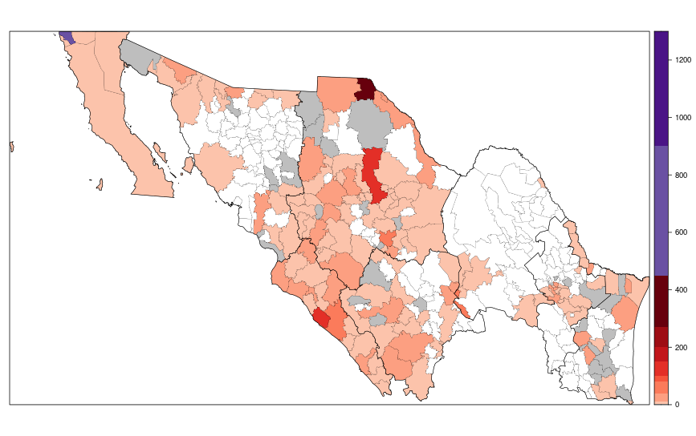</td>
</tr>
</table>

#### logGamma2

<table align='center'>
<tr>
<td></td>
<td></td>
</tr>
</table>

#### half.Normal

<table align='center'>
<tr>
<td></td>
<td></td>
</tr>
</table>

#### half.Cauchy

<table align='center'>
<tr>
<td></td>
<td></td>
</tr>
</table>

#### half.T

<table align='center'>
<tr>
<td></td>
<td></td>
</tr>
</table>

#### unif

<table align='center'>
<tr>
<td></td>
<td></td>
</tr>
</table>

#### pc.prec

<table align='center'>
<tr>
<td>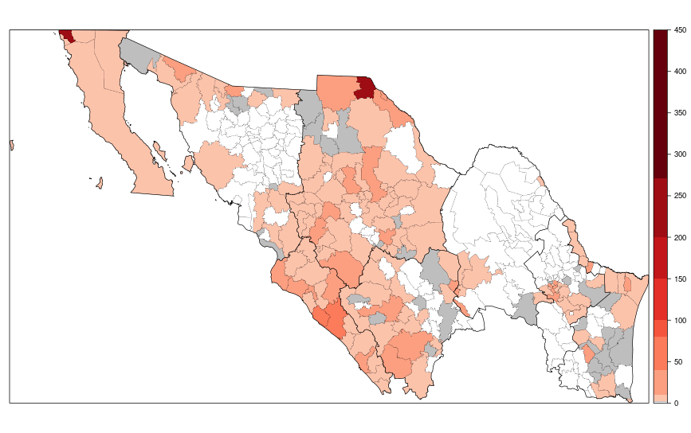</td>
<td></td>
</tr>
</table>

### Temporal random effects

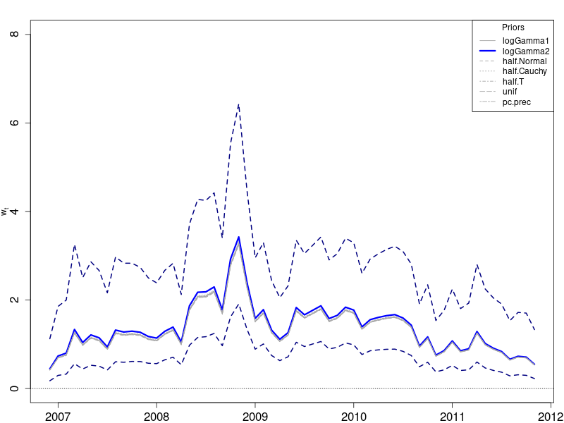

### Metrics evaluation

Posterior coefficients.

<table>
 <thead>
  <tr>
   <th style="text-align:left;"> term </th>
   <th style="text-align:right;"> logGamma1 </th>
   <th style="text-align:right;"> logGamma2 </th>
   <th style="text-align:right;"> half.Normal </th>
   <th style="text-align:right;"> half.Cauchy </th>
   <th style="text-align:right;"> half.T </th>
   <th style="text-align:right;"> unif </th>
   <th style="text-align:right;"> pc.prec </th>
  </tr>
 </thead>
<tbody>
  <tr>
   <td style="text-align:left;"> (Intercept) </td>
   <td style="text-align:right;"> 0.01 </td>
   <td style="text-align:right;"> 0.01 </td>
   <td style="text-align:right;"> 0.01 </td>
   <td style="text-align:right;"> 0.01 </td>
   <td style="text-align:right;"> 0.01 </td>
   <td style="text-align:right;"> 0.01 </td>
   <td style="text-align:right;"> 0.01 </td>
  </tr>
  <tr>
   <td style="text-align:left;"> amap </td>
   <td style="text-align:right;"> 1.11 </td>
   <td style="text-align:right;"> 1.11 </td>
   <td style="text-align:right;"> 1.11 </td>
   <td style="text-align:right;"> 1.11 </td>
   <td style="text-align:right;"> 1.11 </td>
   <td style="text-align:right;"> 1.11 </td>
   <td style="text-align:right;"> 1.11 </td>
  </tr>
  <tr>
   <td style="text-align:left;"> marih </td>
   <td style="text-align:right;"> 0.96 </td>
   <td style="text-align:right;"> 0.96 </td>
   <td style="text-align:right;"> 0.96 </td>
   <td style="text-align:right;"> 0.96 </td>
   <td style="text-align:right;"> 0.96 </td>
   <td style="text-align:right;"> 0.96 </td>
   <td style="text-align:right;"> 0.96 </td>
  </tr>
  <tr>
   <td style="text-align:left;"> rutmig1 </td>
   <td style="text-align:right;"> 4.49 </td>
   <td style="text-align:right;"> 4.40 </td>
   <td style="text-align:right;"> 4.39 </td>
   <td style="text-align:right;"> 4.38 </td>
   <td style="text-align:right;"> 4.38 </td>
   <td style="text-align:right;"> 4.39 </td>
   <td style="text-align:right;"> 4.37 </td>
  </tr>
  <tr>
   <td style="text-align:left;"> enfren.lweek </td>
   <td style="text-align:right;"> NA </td>
   <td style="text-align:right;"> NA </td>
   <td style="text-align:right;"> NA </td>
   <td style="text-align:right;"> NA </td>
   <td style="text-align:right;"> NA </td>
   <td style="text-align:right;"> NA </td>
   <td style="text-align:right;"> NA </td>
  </tr>
  <tr>
   <td style="text-align:left;"> ym1 </td>
   <td style="text-align:right;"> 1.74 </td>
   <td style="text-align:right;"> 1.75 </td>
   <td style="text-align:right;"> 1.73 </td>
   <td style="text-align:right;"> 1.74 </td>
   <td style="text-align:right;"> 1.73 </td>
   <td style="text-align:right;"> 1.73 </td>
   <td style="text-align:right;"> 1.73 </td>
  </tr>
</tbody>
</table>

Metrics

<table>
 <thead>
  <tr>
   <th style="text-align:left;"> metrica </th>
   <th style="text-align:right;"> logGamma1 </th>
   <th style="text-align:right;"> logGamma2 </th>
   <th style="text-align:right;"> half.Normal </th>
   <th style="text-align:right;"> half.Cauchy </th>
   <th style="text-align:right;"> half.T </th>
   <th style="text-align:right;"> unif </th>
   <th style="text-align:right;"> pc.prec </th>
  </tr>
 </thead>
<tbody>
  <tr>
   <td style="text-align:left;"> RMSE </td>
   <td style="text-align:right;"> 9.15 </td>
   <td style="text-align:right;"> 9.15 </td>
   <td style="text-align:right;"> 9.15 </td>
   <td style="text-align:right;"> 9.15 </td>
   <td style="text-align:right;"> 9.15 </td>
   <td style="text-align:right;"> 9.15 </td>
   <td style="text-align:right;"> 9.15 </td>
  </tr>
  <tr>
   <td style="text-align:left;"> DIC </td>
   <td style="text-align:right;"> 36655.33 </td>
   <td style="text-align:right;"> 36654.78 </td>
   <td style="text-align:right;"> 36654.73 </td>
   <td style="text-align:right;"> 36654.49 </td>
   <td style="text-align:right;"> 36653.51 </td>
   <td style="text-align:right;"> 36654.66 </td>
   <td style="text-align:right;"> 36654.56 </td>
  </tr>
  <tr>
   <td style="text-align:left;"> CPO </td>
   <td style="text-align:right;"> -19775.02 </td>
   <td style="text-align:right;"> -19622.78 </td>
   <td style="text-align:right;"> -19543.85 </td>
   <td style="text-align:right;"> -19484.74 </td>
   <td style="text-align:right;"> -19466.86 </td>
   <td style="text-align:right;"> -19530.79 </td>
   <td style="text-align:right;"> -19505.75 </td>
  </tr>
  <tr>
   <td style="text-align:left;"> R2 </td>
   <td style="text-align:right;"> 0.82 </td>
   <td style="text-align:right;"> 0.82 </td>
   <td style="text-align:right;"> 0.82 </td>
   <td style="text-align:right;"> 0.82 </td>
   <td style="text-align:right;"> 0.82 </td>
   <td style="text-align:right;"> 0.82 </td>
   <td style="text-align:right;"> 0.82 </td>
  </tr>
</tbody>
</table>

## CAR + AR model: Migration effect removed

### Posterior distribution of fixed effects

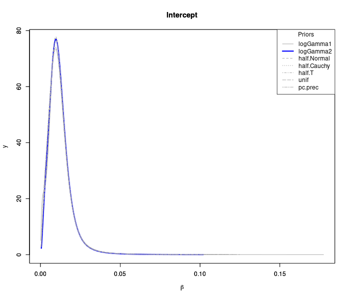

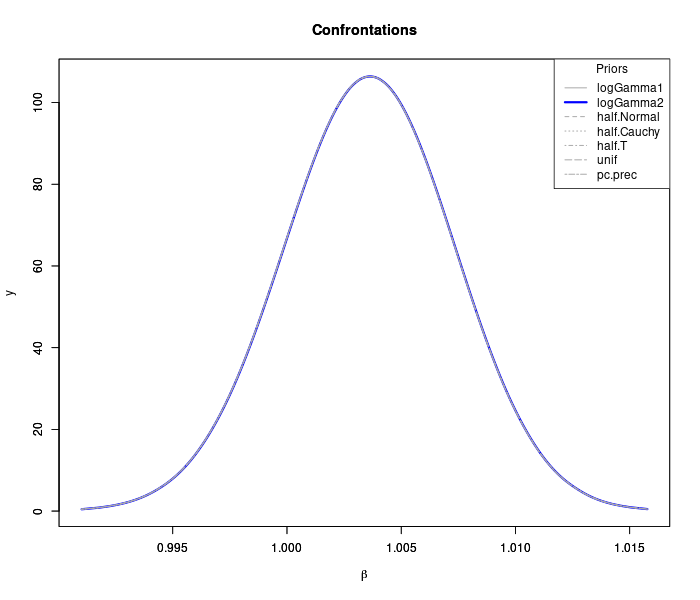

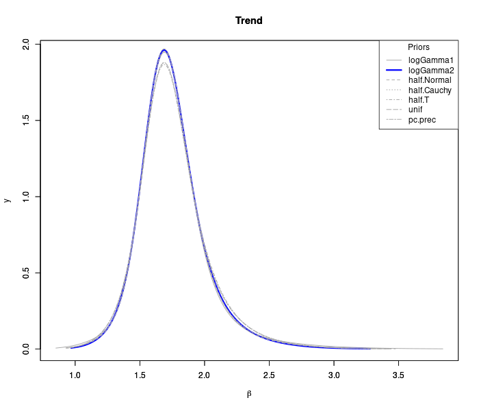

### Spatial random effects. Structured (left) and unstructured (right)

#### logGamma1

<table align='center'>
<tr>
<td>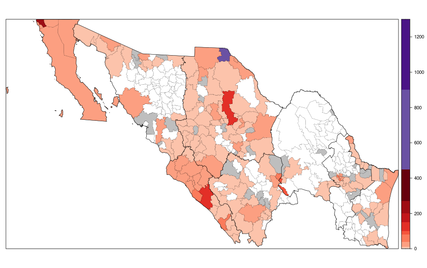</td>
<td></td>
</tr>
</table>

#### logGamma2

<table align='center'>
<tr>
<td></td>
<td></td>
</tr>
</table>

#### half.Normal

<table align='center'>
<tr>
<td>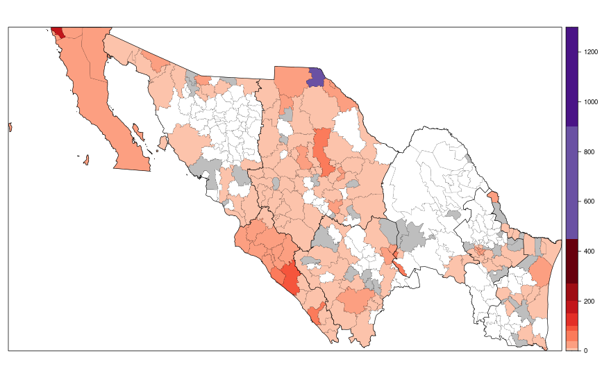</td>
<td></td>
</tr>
</table>

#### half.Cauchy

<table align='center'>
<tr>
<td></td>
<td>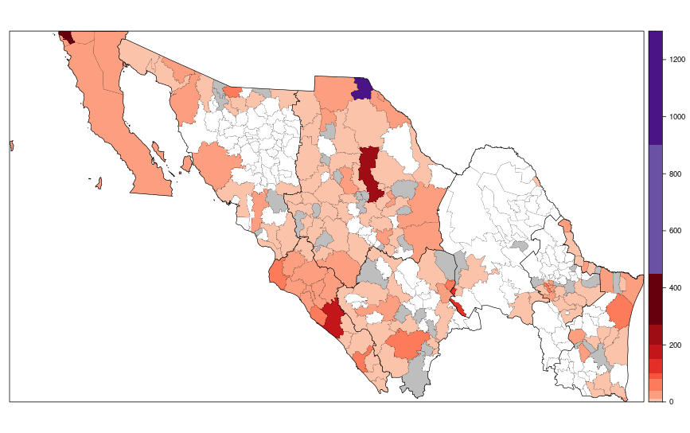</td>
</tr>
</table>

#### half.T

<table align='center'>
<tr>
<td></td>
<td></td>
</tr>
</table>

#### unif

<table align='center'>
<tr>
<td></td>
<td></td>
</tr>
</table>

#### pc.prec

<table align='center'>
<tr>
<td></td>
<td></td>
</tr>
</table>

### Temporal random effects

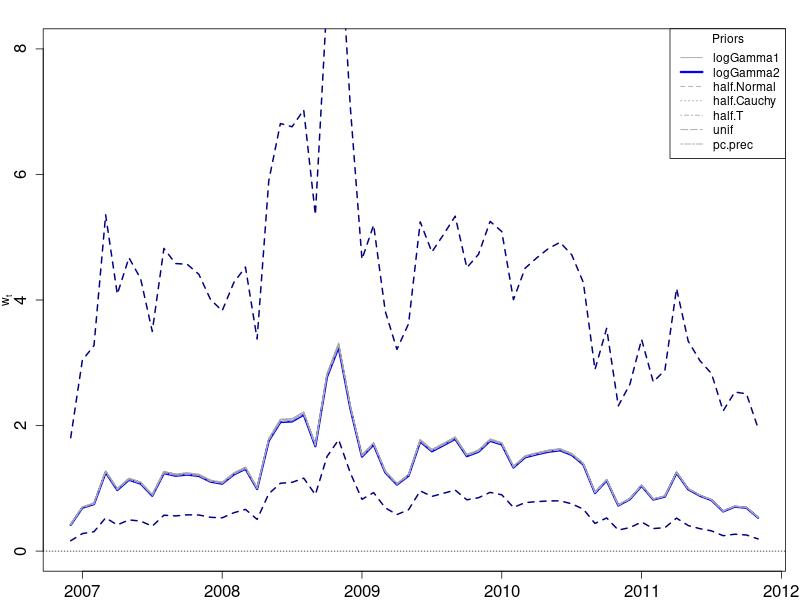

### Metrics evaluation

Posterior coefficients.

<table>
 <thead>
  <tr>
   <th style="text-align:left;"> term </th>
   <th style="text-align:right;"> logGamma1 </th>
   <th style="text-align:right;"> logGamma2 </th>
   <th style="text-align:right;"> half.Normal </th>
   <th style="text-align:right;"> half.Cauchy </th>
   <th style="text-align:right;"> half.T </th>
   <th style="text-align:right;"> unif </th>
   <th style="text-align:right;"> pc.prec </th>
  </tr>
 </thead>
<tbody>
  <tr>
   <td style="text-align:left;"> (Intercept) </td>
   <td style="text-align:right;"> 0.01 </td>
   <td style="text-align:right;"> 0.01 </td>
   <td style="text-align:right;"> 0.01 </td>
   <td style="text-align:right;"> 0.01 </td>
   <td style="text-align:right;"> 0.01 </td>
   <td style="text-align:right;"> 0.01 </td>
   <td style="text-align:right;"> 0.01 </td>
  </tr>
  <tr>
   <td style="text-align:left;"> amap </td>
   <td style="text-align:right;"> 1.11 </td>
   <td style="text-align:right;"> 1.11 </td>
   <td style="text-align:right;"> 1.11 </td>
   <td style="text-align:right;"> 1.11 </td>
   <td style="text-align:right;"> 1.11 </td>
   <td style="text-align:right;"> 1.11 </td>
   <td style="text-align:right;"> 1.11 </td>
  </tr>
  <tr>
   <td style="text-align:left;"> marih </td>
   <td style="text-align:right;"> 0.96 </td>
   <td style="text-align:right;"> 0.96 </td>
   <td style="text-align:right;"> 0.96 </td>
   <td style="text-align:right;"> 0.96 </td>
   <td style="text-align:right;"> 0.96 </td>
   <td style="text-align:right;"> 0.96 </td>
   <td style="text-align:right;"> 0.96 </td>
  </tr>
  <tr>
   <td style="text-align:left;"> rutmig1 </td>
   <td style="text-align:right;"> NA </td>
   <td style="text-align:right;"> NA </td>
   <td style="text-align:right;"> NA </td>
   <td style="text-align:right;"> NA </td>
   <td style="text-align:right;"> NA </td>
   <td style="text-align:right;"> NA </td>
   <td style="text-align:right;"> NA </td>
  </tr>
  <tr>
   <td style="text-align:left;"> enfren.lweek </td>
   <td style="text-align:right;"> 1.00 </td>
   <td style="text-align:right;"> 1.00 </td>
   <td style="text-align:right;"> 1.00 </td>
   <td style="text-align:right;"> 1.00 </td>
   <td style="text-align:right;"> 1.00 </td>
   <td style="text-align:right;"> 1.00 </td>
   <td style="text-align:right;"> 1.00 </td>
  </tr>
  <tr>
   <td style="text-align:left;"> ym1 </td>
   <td style="text-align:right;"> 1.73 </td>
   <td style="text-align:right;"> 1.73 </td>
   <td style="text-align:right;"> 1.73 </td>
   <td style="text-align:right;"> 1.74 </td>
   <td style="text-align:right;"> 1.74 </td>
   <td style="text-align:right;"> 1.74 </td>
   <td style="text-align:right;"> 1.73 </td>
  </tr>
</tbody>
</table>

Metrics

<table>
 <thead>
  <tr>
   <th style="text-align:left;"> metrica </th>
   <th style="text-align:right;"> logGamma1 </th>
   <th style="text-align:right;"> logGamma2 </th>
   <th style="text-align:right;"> half.Normal </th>
   <th style="text-align:right;"> half.Cauchy </th>
   <th style="text-align:right;"> half.T </th>
   <th style="text-align:right;"> unif </th>
   <th style="text-align:right;"> pc.prec </th>
  </tr>
 </thead>
<tbody>
  <tr>
   <td style="text-align:left;"> RMSE </td>
   <td style="text-align:right;"> 9.15 </td>
   <td style="text-align:right;"> 9.15 </td>
   <td style="text-align:right;"> 9.15 </td>
   <td style="text-align:right;"> 9.15 </td>
   <td style="text-align:right;"> 9.15 </td>
   <td style="text-align:right;"> 9.15 </td>
   <td style="text-align:right;"> 9.15 </td>
  </tr>
  <tr>
   <td style="text-align:left;"> DIC </td>
   <td style="text-align:right;"> 36662.37 </td>
   <td style="text-align:right;"> 36663.68 </td>
   <td style="text-align:right;"> 36664.81 </td>
   <td style="text-align:right;"> 36664.24 </td>
   <td style="text-align:right;"> 36663.82 </td>
   <td style="text-align:right;"> 36664.93 </td>
   <td style="text-align:right;"> 36664.00 </td>
  </tr>
  <tr>
   <td style="text-align:left;"> CPO </td>
   <td style="text-align:right;"> -19903.60 </td>
   <td style="text-align:right;"> -19917.67 </td>
   <td style="text-align:right;"> -19866.42 </td>
   <td style="text-align:right;"> -19873.86 </td>
   <td style="text-align:right;"> -19844.06 </td>
   <td style="text-align:right;"> -19911.76 </td>
   <td style="text-align:right;"> -19814.36 </td>
  </tr>
  <tr>
   <td style="text-align:left;"> R2 </td>
   <td style="text-align:right;"> 0.82 </td>
   <td style="text-align:right;"> 0.82 </td>
   <td style="text-align:right;"> 0.82 </td>
   <td style="text-align:right;"> 0.82 </td>
   <td style="text-align:right;"> 0.82 </td>
   <td style="text-align:right;"> 0.82 </td>
   <td style="text-align:right;"> 0.82 </td>
  </tr>
</tbody>
</table>

## ZIP0 + CAR + AR

### Posterior distribution of fixed effects

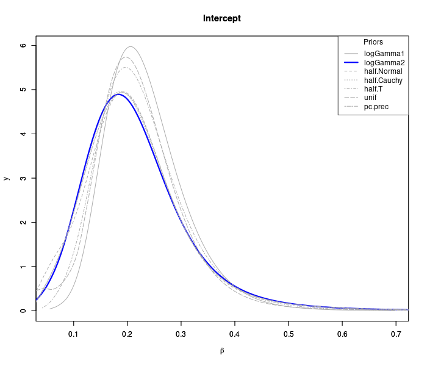

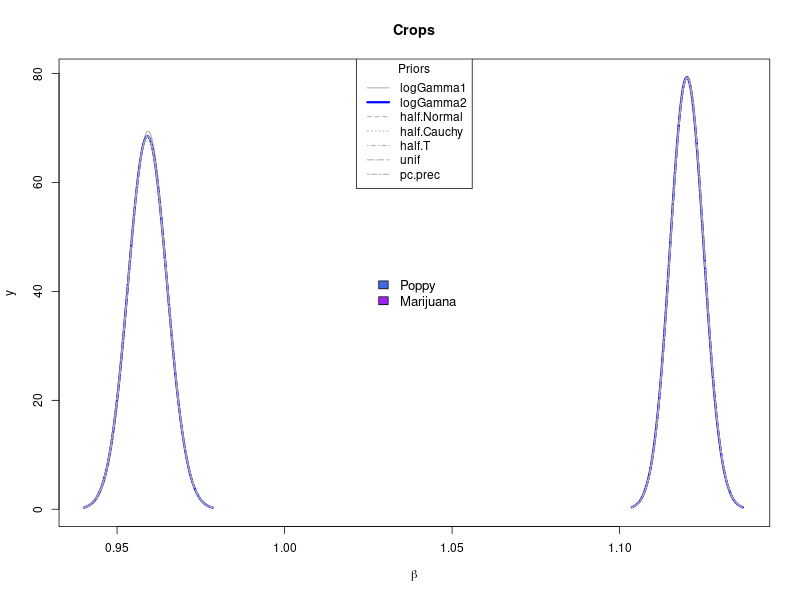

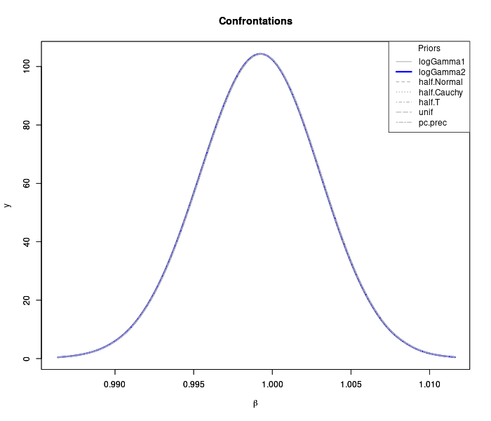

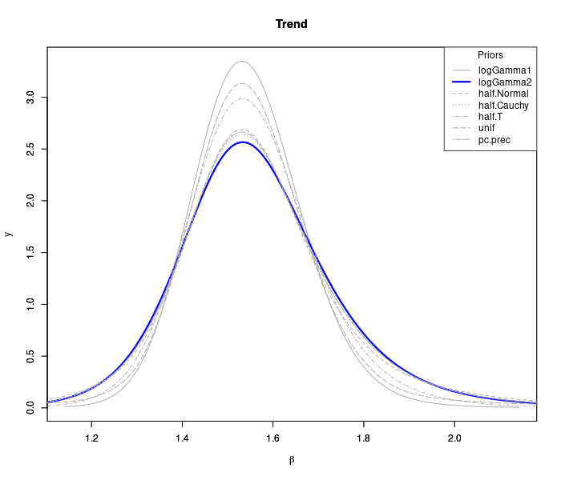

### Spatial random effects. Structured (left) and unstructured (right)

#### logGamma1

<table align='center'>
<tr>
<td>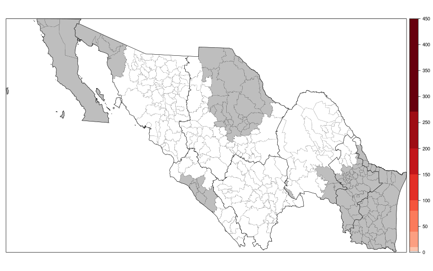</td>
<td>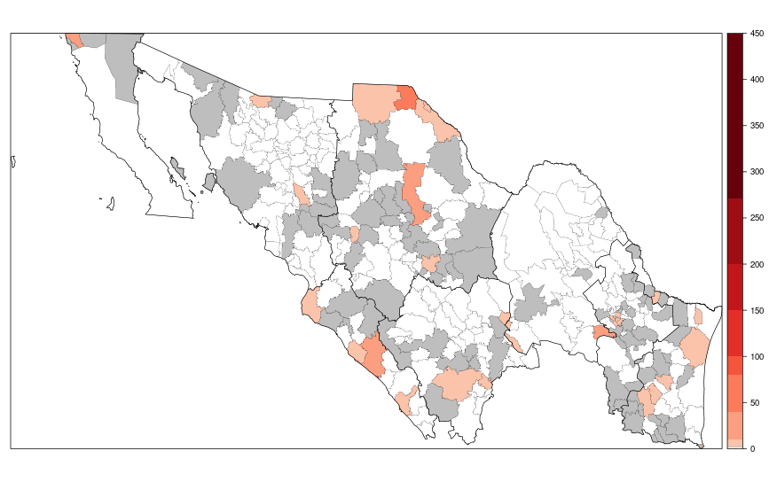</td>
</tr>
</table>

#### logGamma2

<table align='center'>
<tr>
<td>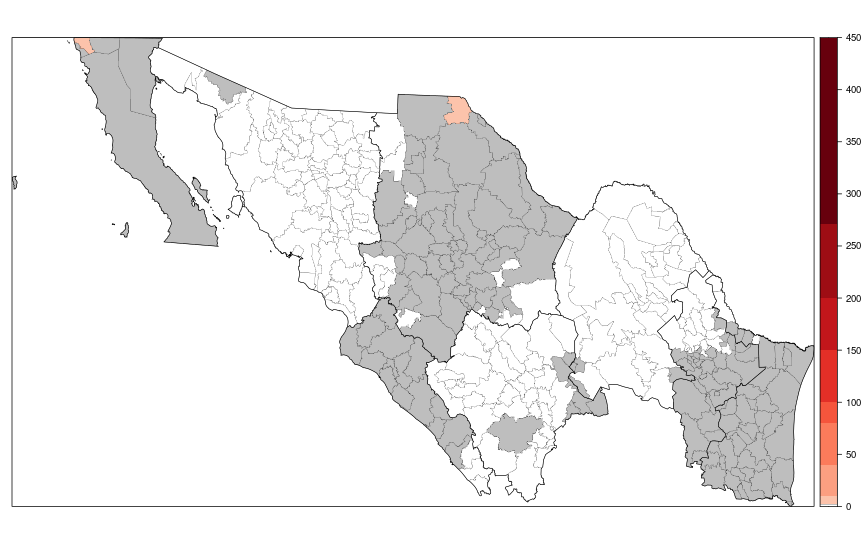</td>
<td></td>
</tr>
</table>

#### half.Normal

<table align='center'>
<tr>
<td>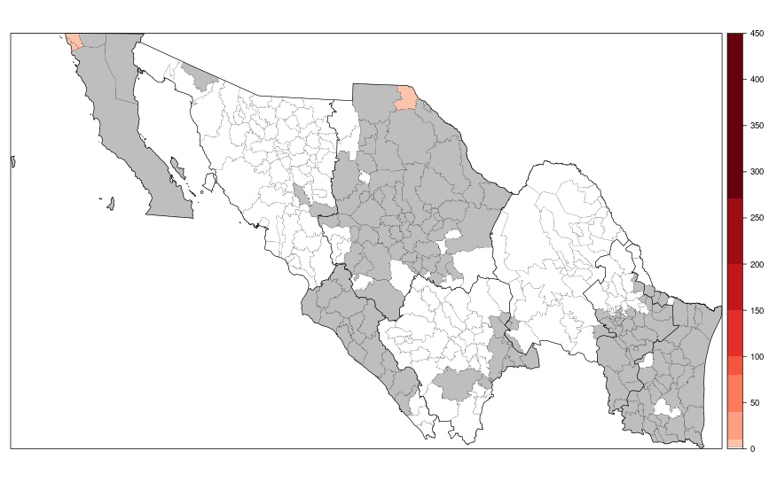</td>
<td></td>
</tr>
</table>

#### half.Cauchy

<table align='center'>
<tr>
<td>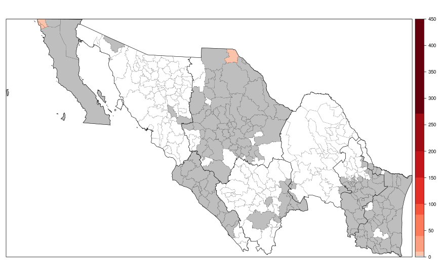</td>
<td></td>
</tr>
</table>

#### half.T

<table align='center'>
<tr>
<td>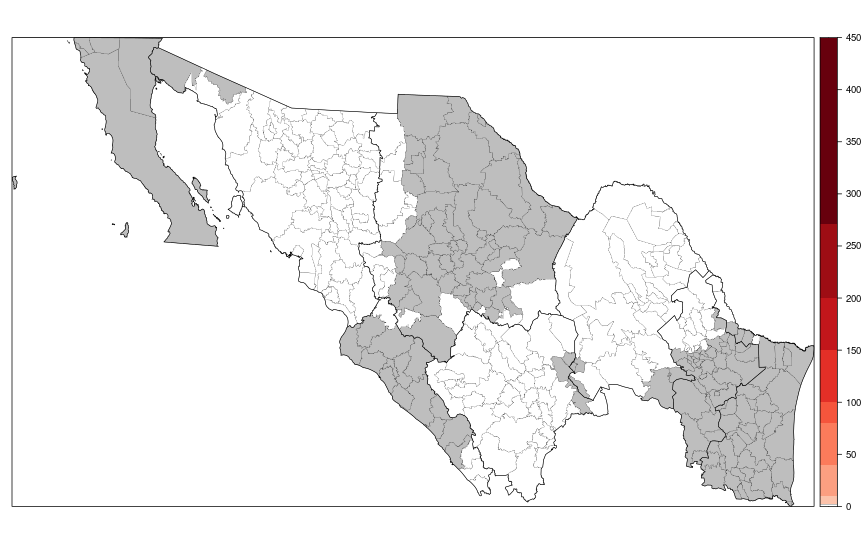</td>
<td>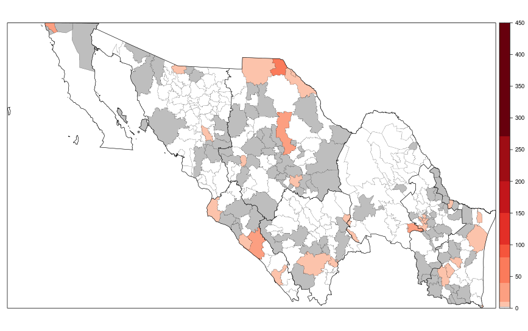</td>
</tr>
</table>

#### unif

<table align='center'>
<tr>
<td></td>
<td>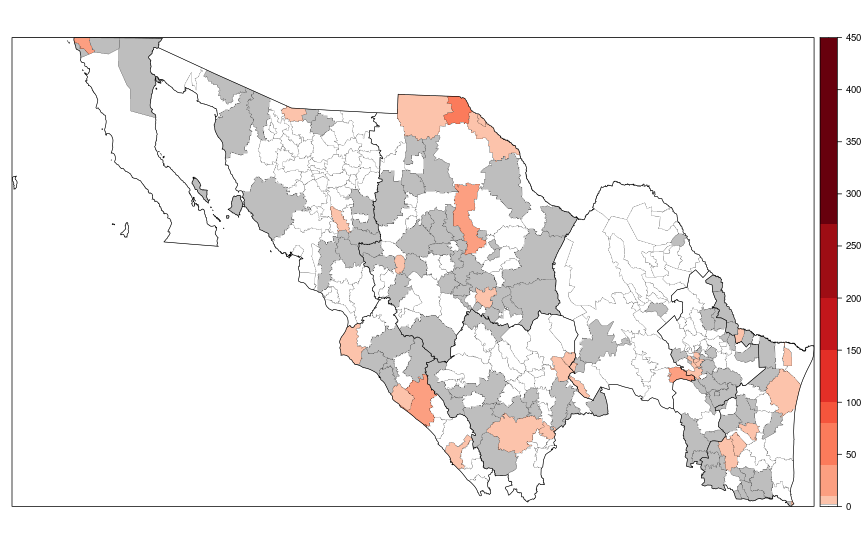</td>
</tr>
</table>

#### pc.prec

<table align='center'>
<tr>
<td></td>
<td></td>
</tr>
</table>

### Temporal random effects

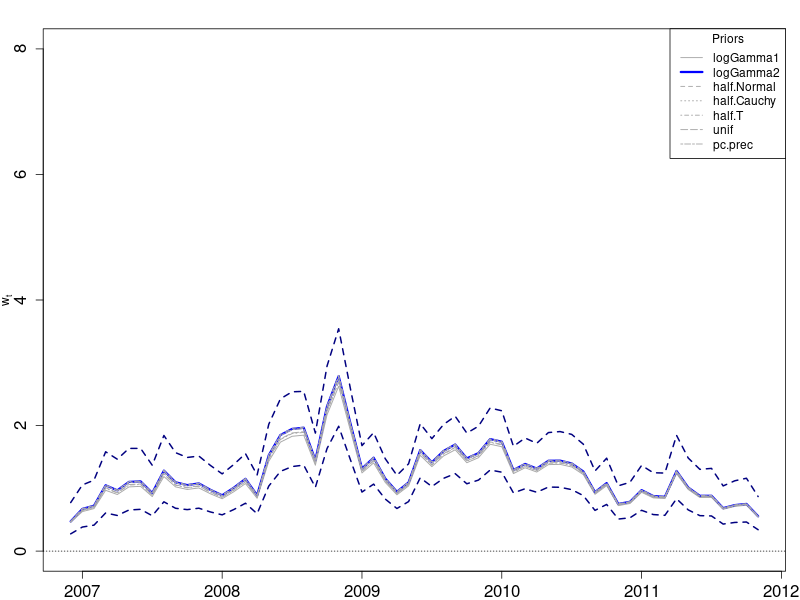

### Metrics evaluation

Posterior coefficients.

<table>
 <thead>
  <tr>
   <th style="text-align:left;"> term </th>
   <th style="text-align:right;"> logGamma1 </th>
   <th style="text-align:right;"> logGamma2 </th>
   <th style="text-align:right;"> half.Normal </th>
   <th style="text-align:right;"> half.Cauchy </th>
   <th style="text-align:right;"> half.T </th>
   <th style="text-align:right;"> unif </th>
   <th style="text-align:right;"> pc.prec </th>
  </tr>
 </thead>
<tbody>
  <tr>
   <td style="text-align:left;"> (Intercept) </td>
   <td style="text-align:right;"> 0.22 </td>
   <td style="text-align:right;"> 0.20 </td>
   <td style="text-align:right;"> 0.19 </td>
   <td style="text-align:right;"> 0.20 </td>
   <td style="text-align:right;"> 0.21 </td>
   <td style="text-align:right;"> 0.20 </td>
   <td style="text-align:right;"> 0.20 </td>
  </tr>
  <tr>
   <td style="text-align:left;"> amap </td>
   <td style="text-align:right;"> 1.12 </td>
   <td style="text-align:right;"> 1.12 </td>
   <td style="text-align:right;"> 1.12 </td>
   <td style="text-align:right;"> 1.12 </td>
   <td style="text-align:right;"> 1.12 </td>
   <td style="text-align:right;"> 1.12 </td>
   <td style="text-align:right;"> 1.12 </td>
  </tr>
  <tr>
   <td style="text-align:left;"> marih </td>
   <td style="text-align:right;"> 0.96 </td>
   <td style="text-align:right;"> 0.96 </td>
   <td style="text-align:right;"> 0.96 </td>
   <td style="text-align:right;"> 0.96 </td>
   <td style="text-align:right;"> 0.96 </td>
   <td style="text-align:right;"> 0.96 </td>
   <td style="text-align:right;"> 0.96 </td>
  </tr>
  <tr>
   <td style="text-align:left;"> rutmig1 </td>
   <td style="text-align:right;"> 1.70 </td>
   <td style="text-align:right;"> 1.68 </td>
   <td style="text-align:right;"> 1.67 </td>
   <td style="text-align:right;"> 1.67 </td>
   <td style="text-align:right;"> 1.68 </td>
   <td style="text-align:right;"> 1.67 </td>
   <td style="text-align:right;"> 1.68 </td>
  </tr>
  <tr>
   <td style="text-align:left;"> enfren.lweek </td>
   <td style="text-align:right;"> 1.00 </td>
   <td style="text-align:right;"> 1.00 </td>
   <td style="text-align:right;"> 1.00 </td>
   <td style="text-align:right;"> 1.00 </td>
   <td style="text-align:right;"> 1.00 </td>
   <td style="text-align:right;"> 1.00 </td>
   <td style="text-align:right;"> 1.00 </td>
  </tr>
  <tr>
   <td style="text-align:left;"> ym1 </td>
   <td style="text-align:right;"> 1.54 </td>
   <td style="text-align:right;"> 1.56 </td>
   <td style="text-align:right;"> 1.56 </td>
   <td style="text-align:right;"> 1.56 </td>
   <td style="text-align:right;"> 1.55 </td>
   <td style="text-align:right;"> 1.55 </td>
   <td style="text-align:right;"> 1.56 </td>
  </tr>
</tbody>
</table>

Metrics

<table>
 <thead>
  <tr>
   <th style="text-align:left;"> metrica </th>
   <th style="text-align:right;"> logGamma1 </th>
   <th style="text-align:right;"> logGamma2 </th>
   <th style="text-align:right;"> half.Normal </th>
   <th style="text-align:right;"> half.Cauchy </th>
   <th style="text-align:right;"> half.T </th>
   <th style="text-align:right;"> unif </th>
   <th style="text-align:right;"> pc.prec </th>
  </tr>
 </thead>
<tbody>
  <tr>
   <td style="text-align:left;"> RMSE </td>
   <td style="text-align:right;"> 9.95 </td>
   <td style="text-align:right;"> 9.89 </td>
   <td style="text-align:right;"> 9.87 </td>
   <td style="text-align:right;"> 9.88 </td>
   <td style="text-align:right;"> 9.91 </td>
   <td style="text-align:right;"> 9.87 </td>
   <td style="text-align:right;"> 9.88 </td>
  </tr>
  <tr>
   <td style="text-align:left;"> DIC </td>
   <td style="text-align:right;"> 40552.20 </td>
   <td style="text-align:right;"> 40548.65 </td>
   <td style="text-align:right;"> 40548.98 </td>
   <td style="text-align:right;"> 40548.60 </td>
   <td style="text-align:right;"> 40549.84 </td>
   <td style="text-align:right;"> 40547.45 </td>
   <td style="text-align:right;"> 40549.06 </td>
  </tr>
  <tr>
   <td style="text-align:left;"> CPO </td>
   <td style="text-align:right;"> -21538.38 </td>
   <td style="text-align:right;"> -21615.10 </td>
   <td style="text-align:right;"> -21629.85 </td>
   <td style="text-align:right;"> -21635.99 </td>
   <td style="text-align:right;"> -21563.38 </td>
   <td style="text-align:right;"> -21624.69 </td>
   <td style="text-align:right;"> -21631.88 </td>
  </tr>
  <tr>
   <td style="text-align:left;"> R2 </td>
   <td style="text-align:right;"> 0.82 </td>
   <td style="text-align:right;"> 0.82 </td>
   <td style="text-align:right;"> 0.82 </td>
   <td style="text-align:right;"> 0.82 </td>
   <td style="text-align:right;"> 0.82 </td>
   <td style="text-align:right;"> 0.82 </td>
   <td style="text-align:right;"> 0.82 </td>
  </tr>
</tbody>
</table>

## ZIP1 + CAR + AR

### Posterior distribution of fixed effects

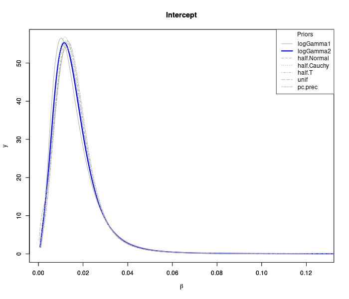

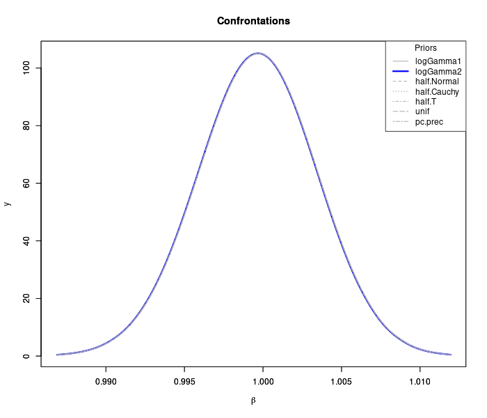

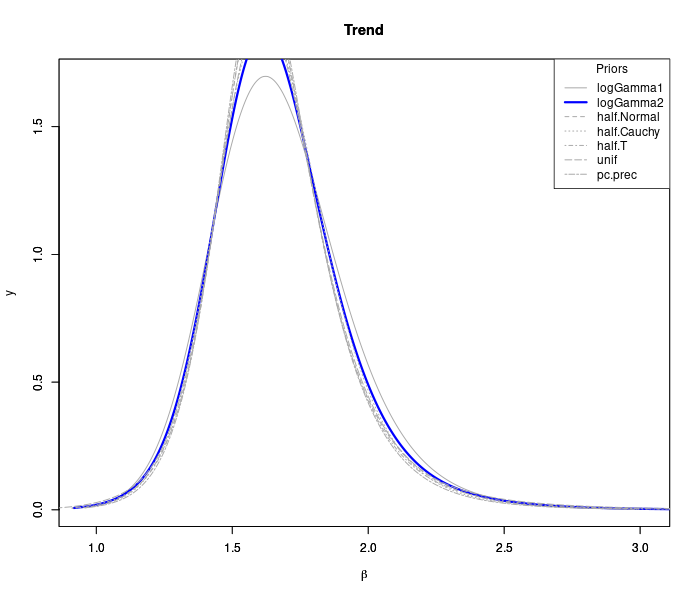

### Spatial random effects. Structured (left) and unstructured (right)

#### logGamma1

<table align='center'>
<tr>
<td></td>
<td>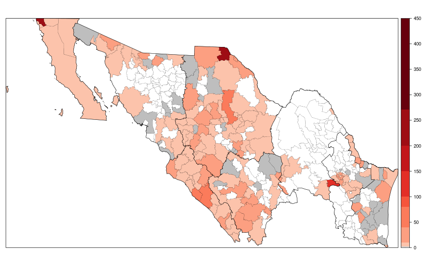</td>
</tr>
</table>

#### logGamma2

<table align='center'>
<tr>
<td></td>
<td></td>
</tr>
</table>

#### half.Normal

<table align='center'>
<tr>
<td></td>
<td>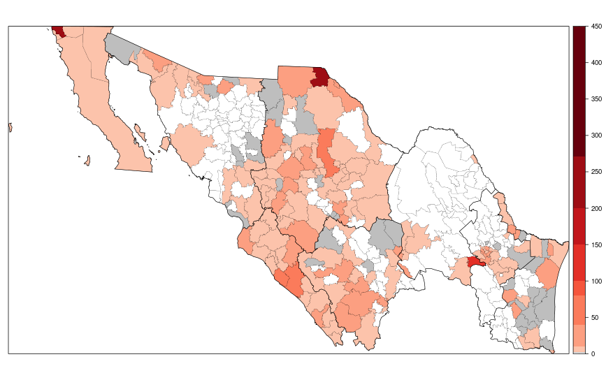</td>
</tr>
</table>

#### half.Cauchy

<table align='center'>
<tr>
<td>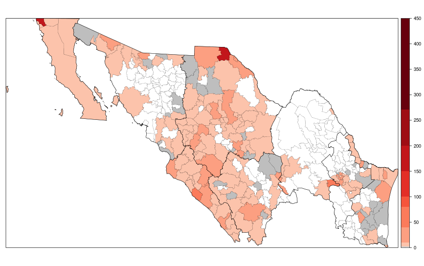</td>
<td></td>
</tr>
</table>

#### half.T

<table align='center'>
<tr>
<td></td>
<td></td>
</tr>
</table>

#### unif

<table align='center'>
<tr>
<td>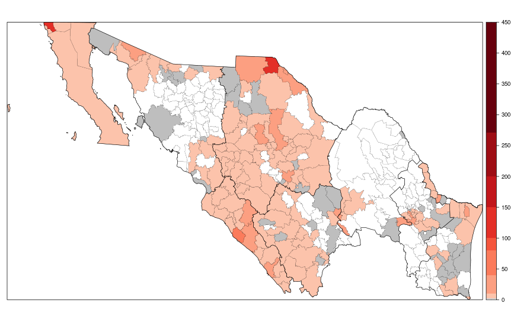</td>
<td></td>
</tr>
</table>

#### pc.prec

<table align='center'>
<tr>
<td></td>
<td></td>
</tr>
</table>

### Temporal random effects

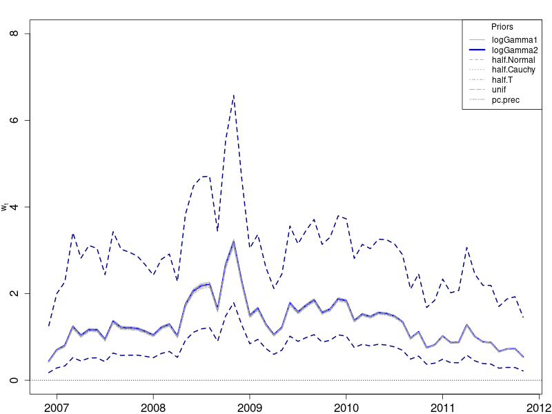

### Metrics evaluation

Posterior coefficients.

<table>
 <thead>
  <tr>
   <th style="text-align:left;"> term </th>
   <th style="text-align:right;"> logGamma1 </th>
   <th style="text-align:right;"> logGamma2 </th>
   <th style="text-align:right;"> half.Normal </th>
   <th style="text-align:right;"> half.Cauchy </th>
   <th style="text-align:right;"> half.T </th>
   <th style="text-align:right;"> unif </th>
   <th style="text-align:right;"> pc.prec </th>
  </tr>
 </thead>
<tbody>
  <tr>
   <td style="text-align:left;"> (Intercept) </td>
   <td style="text-align:right;"> 0.01 </td>
   <td style="text-align:right;"> 0.01 </td>
   <td style="text-align:right;"> 0.01 </td>
   <td style="text-align:right;"> 0.01 </td>
   <td style="text-align:right;"> 0.01 </td>
   <td style="text-align:right;"> 0.01 </td>
   <td style="text-align:right;"> 0.01 </td>
  </tr>
  <tr>
   <td style="text-align:left;"> amap </td>
   <td style="text-align:right;"> 1.11 </td>
   <td style="text-align:right;"> 1.11 </td>
   <td style="text-align:right;"> 1.11 </td>
   <td style="text-align:right;"> 1.11 </td>
   <td style="text-align:right;"> 1.11 </td>
   <td style="text-align:right;"> 1.11 </td>
   <td style="text-align:right;"> 1.11 </td>
  </tr>
  <tr>
   <td style="text-align:left;"> marih </td>
   <td style="text-align:right;"> 0.96 </td>
   <td style="text-align:right;"> 0.96 </td>
   <td style="text-align:right;"> 0.96 </td>
   <td style="text-align:right;"> 0.96 </td>
   <td style="text-align:right;"> 0.96 </td>
   <td style="text-align:right;"> 0.96 </td>
   <td style="text-align:right;"> 0.96 </td>
  </tr>
  <tr>
   <td style="text-align:left;"> rutmig1 </td>
   <td style="text-align:right;"> 3.75 </td>
   <td style="text-align:right;"> 3.75 </td>
   <td style="text-align:right;"> 3.76 </td>
   <td style="text-align:right;"> 3.75 </td>
   <td style="text-align:right;"> 3.75 </td>
   <td style="text-align:right;"> 3.76 </td>
   <td style="text-align:right;"> 3.74 </td>
  </tr>
  <tr>
   <td style="text-align:left;"> enfren.lweek </td>
   <td style="text-align:right;"> 1.00 </td>
   <td style="text-align:right;"> 1.00 </td>
   <td style="text-align:right;"> 1.00 </td>
   <td style="text-align:right;"> 1.00 </td>
   <td style="text-align:right;"> 1.00 </td>
   <td style="text-align:right;"> 1.00 </td>
   <td style="text-align:right;"> 1.00 </td>
  </tr>
  <tr>
   <td style="text-align:left;"> ym1 </td>
   <td style="text-align:right;"> 1.66 </td>
   <td style="text-align:right;"> 1.66 </td>
   <td style="text-align:right;"> 1.65 </td>
   <td style="text-align:right;"> 1.65 </td>
   <td style="text-align:right;"> 1.65 </td>
   <td style="text-align:right;"> 1.65 </td>
   <td style="text-align:right;"> 1.65 </td>
  </tr>
</tbody>
</table>

Metrics

<table>
 <thead>
  <tr>
   <th style="text-align:left;"> metrica </th>
   <th style="text-align:right;"> logGamma1 </th>
   <th style="text-align:right;"> logGamma2 </th>
   <th style="text-align:right;"> half.Normal </th>
   <th style="text-align:right;"> half.Cauchy </th>
   <th style="text-align:right;"> half.T </th>
   <th style="text-align:right;"> unif </th>
   <th style="text-align:right;"> pc.prec </th>
  </tr>
 </thead>
<tbody>
  <tr>
   <td style="text-align:left;"> RMSE </td>
   <td style="text-align:right;"> 9.37 </td>
   <td style="text-align:right;"> 9.36 </td>
   <td style="text-align:right;"> 9.37 </td>
   <td style="text-align:right;"> 9.37 </td>
   <td style="text-align:right;"> 9.36 </td>
   <td style="text-align:right;"> 9.37 </td>
   <td style="text-align:right;"> 9.36 </td>
  </tr>
  <tr>
   <td style="text-align:left;"> DIC </td>
   <td style="text-align:right;"> 34319.12 </td>
   <td style="text-align:right;"> 34318.33 </td>
   <td style="text-align:right;"> 34320.43 </td>
   <td style="text-align:right;"> 34319.03 </td>
   <td style="text-align:right;"> 34318.91 </td>
   <td style="text-align:right;"> 34321.16 </td>
   <td style="text-align:right;"> 34318.60 </td>
  </tr>
  <tr>
   <td style="text-align:left;"> CPO </td>
   <td style="text-align:right;"> -17850.51 </td>
   <td style="text-align:right;"> -17850.94 </td>
   <td style="text-align:right;"> -17853.92 </td>
   <td style="text-align:right;"> -17851.80 </td>
   <td style="text-align:right;"> -17852.59 </td>
   <td style="text-align:right;"> -17856.86 </td>
   <td style="text-align:right;"> -17854.24 </td>
  </tr>
  <tr>
   <td style="text-align:left;"> R2 </td>
   <td style="text-align:right;"> 0.83 </td>
   <td style="text-align:right;"> 0.83 </td>
   <td style="text-align:right;"> 0.83 </td>
   <td style="text-align:right;"> 0.83 </td>
   <td style="text-align:right;"> 0.83 </td>
   <td style="text-align:right;"> 0.83 </td>
   <td style="text-align:right;"> 0.83 </td>
  </tr>
</tbody>
</table>
