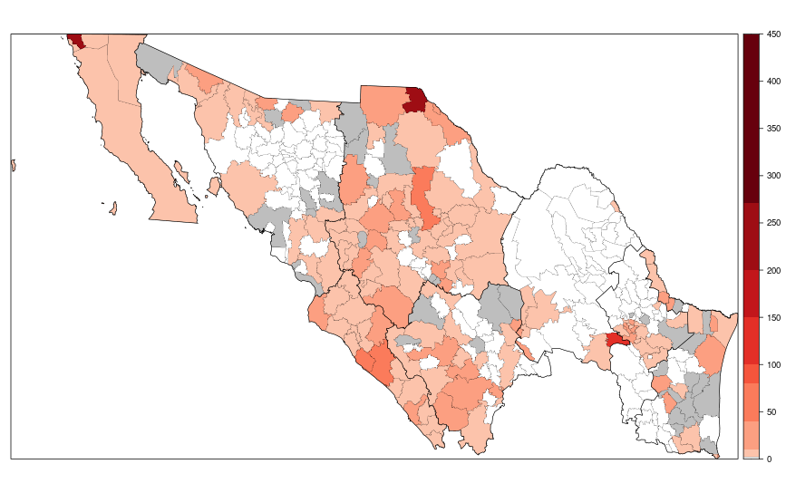

# Sensitivity analysis for $\pi_0$, the probability of observing a zero in ZIP models

Priors distributions considered. Note that all priors in INLA are set in the internal representation of the parameter, therefore, $p=\exp^{\theta}/(1+\exp^{\theta})$, and the prior is defined on $\theta$.

- `gaussian1`: Gaussian with parameters mean= 0 and precision=.2
- `gaussian2`: Gaussian with parameters mean= 0 and precision=.5
- `gaussian3`: Gaussian with parameters mean= 0 and precision= 1
- `gaussian4`: Gaussian with parameters mean= 0 and precision= 5
- `gaussian5`: Gaussian with parameters mean= 0 and precision=10

### Posterior distribution on $\pi_0$

### ZIP0

#### Posterior distribution of fixed effects

#### Spatial random effects. Structured (left) and unstructured (right)

##### gaussian1

<table align='center'>
<tr>
<td></td>
<td></td>
</tr>
</table>

##### gaussian2

<table align='center'>
<tr>
<td></td>
<td></td>
</tr>
</table>

##### gaussian3

<table align='center'>
<tr>
<td></td>
<td></td>
</tr>
</table>

##### gaussian4

<table align='center'>
<tr>
<td></td>
<td></td>
</tr>
</table>

##### gaussian5

<table align='center'>
<tr>
<td></td>
<td></td>
</tr>
</table>

#### Temporal random effects

#### Metrics evaluation

Posterior coefficients.

<table>
 <thead>
  <tr>
   <th style="text-align:left;"> term </th>
   <th style="text-align:right;"> gaussian1 </th>
   <th style="text-align:right;"> gaussian2 </th>
   <th style="text-align:right;"> gaussian3 </th>
   <th style="text-align:right;"> gaussian4 </th>
   <th style="text-align:right;"> gaussian5 </th>
  </tr>
 </thead>
<tbody>
  <tr>
   <td style="text-align:left;"> (Intercept) </td>
   <td style="text-align:right;"> 0.21 </td>
   <td style="text-align:right;"> 0.21 </td>
   <td style="text-align:right;"> 0.22 </td>
   <td style="text-align:right;"> 0.20 </td>
   <td style="text-align:right;"> 0.18 </td>
  </tr>
  <tr>
   <td style="text-align:left;"> amap </td>
   <td style="text-align:right;"> 1.12 </td>
   <td style="text-align:right;"> 1.12 </td>
   <td style="text-align:right;"> 1.12 </td>
   <td style="text-align:right;"> 1.12 </td>
   <td style="text-align:right;"> 1.12 </td>
  </tr>
  <tr>
   <td style="text-align:left;"> marih </td>
   <td style="text-align:right;"> 0.96 </td>
   <td style="text-align:right;"> 0.96 </td>
   <td style="text-align:right;"> 0.96 </td>
   <td style="text-align:right;"> 0.96 </td>
   <td style="text-align:right;"> 0.96 </td>
  </tr>
  <tr>
   <td style="text-align:left;"> rutmig1 </td>
   <td style="text-align:right;"> 1.70 </td>
   <td style="text-align:right;"> 1.69 </td>
   <td style="text-align:right;"> 1.70 </td>
   <td style="text-align:right;"> 1.70 </td>
   <td style="text-align:right;"> 1.70 </td>
  </tr>
  <tr>
   <td style="text-align:left;"> enfren.lweek </td>
   <td style="text-align:right;"> 1.00 </td>
   <td style="text-align:right;"> 1.00 </td>
   <td style="text-align:right;"> 1.00 </td>
   <td style="text-align:right;"> 1.00 </td>
   <td style="text-align:right;"> 1.00 </td>
  </tr>
  <tr>
   <td style="text-align:left;"> ym1 </td>
   <td style="text-align:right;"> 1.55 </td>
   <td style="text-align:right;"> 1.55 </td>
   <td style="text-align:right;"> 1.55 </td>
   <td style="text-align:right;"> 1.56 </td>
   <td style="text-align:right;"> 1.58 </td>
  </tr>
</tbody>
</table>

Metrics

<table>
 <thead>
  <tr>
   <th style="text-align:left;"> metrica </th>
   <th style="text-align:right;"> gaussian1 </th>
   <th style="text-align:right;"> gaussian2 </th>
   <th style="text-align:right;"> gaussian3 </th>
   <th style="text-align:right;"> gaussian4 </th>
   <th style="text-align:right;"> gaussian5 </th>
  </tr>
 </thead>
<tbody>
  <tr>
   <td style="text-align:left;"> RMSE </td>
   <td style="text-align:right;"> 9.95 </td>
   <td style="text-align:right;"> 9.95 </td>
   <td style="text-align:right;"> 9.95 </td>
   <td style="text-align:right;"> 9.95 </td>
   <td style="text-align:right;"> 9.96 </td>
  </tr>
  <tr>
   <td style="text-align:left;"> DIC </td>
   <td style="text-align:right;"> 40550.48 </td>
   <td style="text-align:right;"> 40550.68 </td>
   <td style="text-align:right;"> 40549.93 </td>
   <td style="text-align:right;"> 40552.08 </td>
   <td style="text-align:right;"> 40552.35 </td>
  </tr>
  <tr>
   <td style="text-align:left;"> CPO </td>
   <td style="text-align:right;"> -21570.70 </td>
   <td style="text-align:right;"> -21575.84 </td>
   <td style="text-align:right;"> -21574.00 </td>
   <td style="text-align:right;"> -21594.07 </td>
   <td style="text-align:right;"> -21586.97 </td>
  </tr>
  <tr>
   <td style="text-align:left;"> R2 </td>
   <td style="text-align:right;"> 0.82 </td>
   <td style="text-align:right;"> 0.82 </td>
   <td style="text-align:right;"> 0.82 </td>
   <td style="text-align:right;"> 0.82 </td>
   <td style="text-align:right;"> 0.82 </td>
  </tr>
</tbody>
</table>

### ZIP1

#### Posterior distribution of fixed effects

#### Spatial random effects. Structured (left) and unstructured (right)

##### gaussian1

<table align='center'>
<tr>
<td></td>
<td></td>
</tr>
</table>

##### gaussian2

<table align='center'>
<tr>
<td></td>
<td></td>
</tr>
</table>

##### gaussian3

<table align='center'>
<tr>
<td></td>
<td></td>
</tr>
</table>

##### gaussian4

<table align='center'>
<tr>
<td></td>
<td></td>
</tr>
</table>

##### gaussian5

<table align='center'>
<tr>
<td></td>
<td></td>
</tr>
</table>

#### Temporal random effects

#### Metrics evaluation

Posterior coefficients.

<table>
 <thead>
  <tr>
   <th style="text-align:left;"> term </th>
   <th style="text-align:right;"> logGamma1 </th>
   <th style="text-align:right;"> logGamma2 </th>
   <th style="text-align:right;"> half.Normal </th>
   <th style="text-align:right;"> half.Cauchy </th>
   <th style="text-align:right;"> half.T </th>
   <th style="text-align:right;"> unif </th>
   <th style="text-align:right;"> pc.prec </th>
  </tr>
 </thead>
<tbody>
  <tr>
   <td style="text-align:left;"> (Intercept) </td>
   <td style="text-align:right;"> 0.01 </td>
   <td style="text-align:right;"> 0.01 </td>
   <td style="text-align:right;"> 0.01 </td>
   <td style="text-align:right;"> 0.01 </td>
   <td style="text-align:right;"> 0.01 </td>
   <td style="text-align:right;"> 0.01 </td>
   <td style="text-align:right;"> 0.01 </td>
  </tr>
  <tr>
   <td style="text-align:left;"> amap </td>
   <td style="text-align:right;"> 1.11 </td>
   <td style="text-align:right;"> 1.11 </td>
   <td style="text-align:right;"> 1.11 </td>
   <td style="text-align:right;"> 1.11 </td>
   <td style="text-align:right;"> 1.11 </td>
   <td style="text-align:right;"> 1.11 </td>
   <td style="text-align:right;"> 1.11 </td>
  </tr>
  <tr>
   <td style="text-align:left;"> marih </td>
   <td style="text-align:right;"> 0.96 </td>
   <td style="text-align:right;"> 0.96 </td>
   <td style="text-align:right;"> 0.96 </td>
   <td style="text-align:right;"> 0.96 </td>
   <td style="text-align:right;"> 0.96 </td>
   <td style="text-align:right;"> 0.96 </td>
   <td style="text-align:right;"> 0.96 </td>
  </tr>
  <tr>
   <td style="text-align:left;"> rutmig1 </td>
   <td style="text-align:right;"> 3.75 </td>
   <td style="text-align:right;"> 3.75 </td>
   <td style="text-align:right;"> 3.76 </td>
   <td style="text-align:right;"> 3.75 </td>
   <td style="text-align:right;"> 3.75 </td>
   <td style="text-align:right;"> 3.76 </td>
   <td style="text-align:right;"> 3.74 </td>
  </tr>
  <tr>
   <td style="text-align:left;"> enfren.lweek </td>
   <td style="text-align:right;"> 1.00 </td>
   <td style="text-align:right;"> 1.00 </td>
   <td style="text-align:right;"> 1.00 </td>
   <td style="text-align:right;"> 1.00 </td>
   <td style="text-align:right;"> 1.00 </td>
   <td style="text-align:right;"> 1.00 </td>
   <td style="text-align:right;"> 1.00 </td>
  </tr>
  <tr>
   <td style="text-align:left;"> ym1 </td>
   <td style="text-align:right;"> 1.66 </td>
   <td style="text-align:right;"> 1.66 </td>
   <td style="text-align:right;"> 1.65 </td>
   <td style="text-align:right;"> 1.65 </td>
   <td style="text-align:right;"> 1.65 </td>
   <td style="text-align:right;"> 1.65 </td>
   <td style="text-align:right;"> 1.65 </td>
  </tr>
</tbody>
</table>

Metrics

<table>
 <thead>
  <tr>
   <th style="text-align:left;"> metrica </th>
   <th style="text-align:right;"> logGamma1 </th>
   <th style="text-align:right;"> logGamma2 </th>
   <th style="text-align:right;"> half.Normal </th>
   <th style="text-align:right;"> half.Cauchy </th>
   <th style="text-align:right;"> half.T </th>
   <th style="text-align:right;"> unif </th>
   <th style="text-align:right;"> pc.prec </th>
  </tr>
 </thead>
<tbody>
  <tr>
   <td style="text-align:left;"> RMSE </td>
   <td style="text-align:right;"> 9.37 </td>
   <td style="text-align:right;"> 9.36 </td>
   <td style="text-align:right;"> 9.37 </td>
   <td style="text-align:right;"> 9.37 </td>
   <td style="text-align:right;"> 9.36 </td>
   <td style="text-align:right;"> 9.37 </td>
   <td style="text-align:right;"> 9.36 </td>
  </tr>
  <tr>
   <td style="text-align:left;"> DIC </td>
   <td style="text-align:right;"> 34319.12 </td>
   <td style="text-align:right;"> 34318.33 </td>
   <td style="text-align:right;"> 34320.43 </td>
   <td style="text-align:right;"> 34319.03 </td>
   <td style="text-align:right;"> 34318.91 </td>
   <td style="text-align:right;"> 34321.16 </td>
   <td style="text-align:right;"> 34318.60 </td>
  </tr>
  <tr>
   <td style="text-align:left;"> CPO </td>
   <td style="text-align:right;"> -17850.51 </td>
   <td style="text-align:right;"> -17850.94 </td>
   <td style="text-align:right;"> -17853.92 </td>
   <td style="text-align:right;"> -17851.80 </td>
   <td style="text-align:right;"> -17852.59 </td>
   <td style="text-align:right;"> -17856.86 </td>
   <td style="text-align:right;"> -17854.24 </td>
  </tr>
  <tr>
   <td style="text-align:left;"> R2 </td>
   <td style="text-align:right;"> 0.83 </td>
   <td style="text-align:right;"> 0.83 </td>
   <td style="text-align:right;"> 0.83 </td>
   <td style="text-align:right;"> 0.83 </td>
   <td style="text-align:right;"> 0.83 </td>
   <td style="text-align:right;"> 0.83 </td>
   <td style="text-align:right;"> 0.83 </td>
  </tr>
</tbody>
</table>
