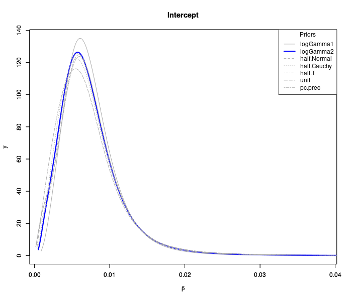
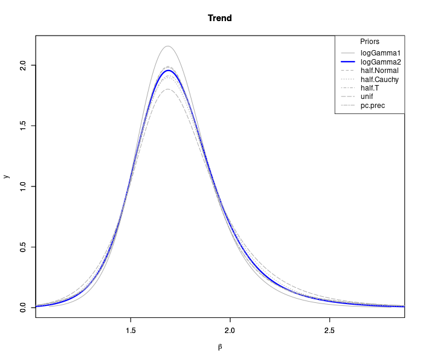

# Sensitivity analysis of hyperparameters for a Bayesian hierarchical spatio-temporal model with separable space and time effects

Let $Y(\mathbf{s},t)$ be a random variable defined at location $\mathbf{s}$ and time $t$. The model is defined by:

\begin{align*}
Y(\mathbf{s}, t) = \mu(\mathbf{s}, t) + v(\mathbf{s}) + w(t) + \epsilon(\mathbf{s}, t),
\end{align*}

where $v(\mathbf{s})$ and $w(t)$ model the spatial and temporal effects, respectively. For observations from areal unit data with discrete time, we will use the notation $Y_{it}$ for observations in the $i-$th spatial unit (municipality) at time period $t$. Our model is based on a Besag–York–Molliè (BYM) model and an autoregressive (AR) of order 1 for the spatial and temporal structure, respectively. This lead us to a three-level hierarchical model: 

\begin{align*}
Y_{it} &\sim \text{Poisson}(\mu_{it})\\ 
E[Y_{it}] &= \mu_{it} = \theta_{it} \\
\log(\theta_{it}) &= x_{it}' \beta + v_i + u_i + w_t\\
v_i & \sim \text{iCAR}(\sigma_v^2)\\
u_i & \sim \text{Normal}(\sigma_u^2)\\
w_t & \sim \text{AR}(1, \sigma_w^2) 
\end{align*}

Priors distributions considered for precision parameter $\sigma$. Note that all priors in INLA are set in the internal representation of the parameter, therefore, $\sigma=\exp^{-\frac{\theta}{2}}$, and the prior is defined on $\theta$.

- `logGamma1`: LogGamma with parameters shape=1 and rate=.00005
- `logGamma1`: LogGamma with parameters shape=.001 and rate=.001
- `half.Normal`: Half-Normal with zero mean and precision parameter $\tau=.001$ 
- `half.Cauchy`: Half-Cauchy with scale parameter $\gamma=25$
- `half.T`: Half-t with parameter $\nu=3$ degrees of freedom
- `unif`: Uniform improper $p(\sigma)\propto 1$
- `pc.prec`: Penalized complexity prior for precision with parameters $(5, 0.01)$

For details, see ....REFERENCES....

## CAR + AR: full model

### Posterior distribution of fixed effects

